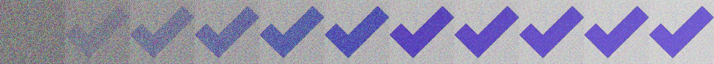

# Improach
Improach takes an input image and approaches that image from a random-pixel image.
 I (Wertzui123) have basically written this implementation in 30 minutes for fun back in 2022.

</img>

## Known issues
* The original will be ever-approached, but never really reached (except when the difference drops below 1 maybe)
* The performance is currently not very good